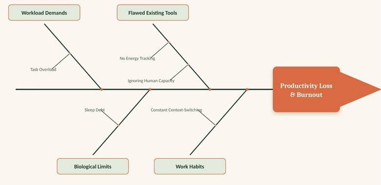
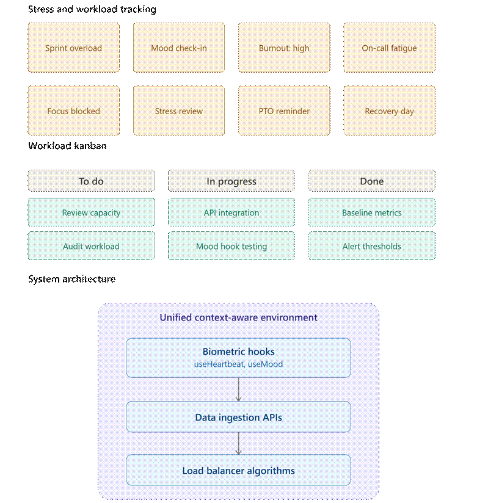
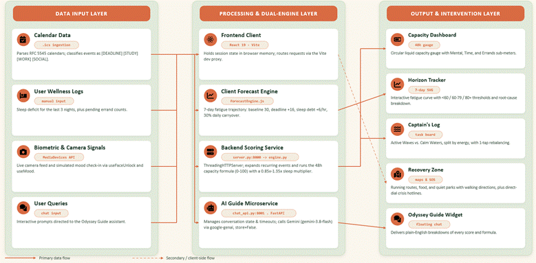
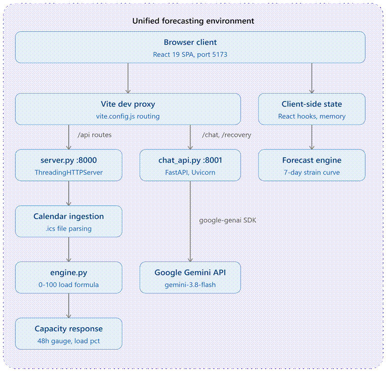

# OASIS by The Odyssey

**Team:** Tan Yong Hung, Joe Vei Xiang Zu, Chew Chen Xi  
**Problem Statement:** Stress & Workload Manager  
**Video Presentation:** [Unlisted Youtube Link]  
**Presentation Slides:** [OASIS by The Odyssey](https://canva.link/ssluz0v31f8f5qb)

---

## 1. Project Overview

University life and academic cultures constantly push people to take on more than their mental and physical limits allow. Regular productivity tools make this worse: they cram every free minute with tasks and give no weight to exhaustion.

Three problems are driving this crisis:

- **Task overload and burnout.** According to the American College Health Association (ACHA-NCHA), over 76% of undergraduate students experience moderate-to-high stress, with continuous deadline clustering driving widespread academic burnout. Juggling irregular study hours with non-stop task demands pushes students into chronic fatigue.
- **Massive productivity loss.** Pushing through severe exhaustion causes brain fog, poor memory retention, and severe motivation drops. Research in Nature Science of Learning (MIT) shows that sleep consistency and cognitive fatigue account for nearly 25% of the variance in student academic performance. Furthermore, the Lumina Foundation & Gallup State of Higher Education Study revealed that 35% of college students have seriously considered dropping out, with emotional stress and mental exhaustion cited as the top reasons.
- **Flaws in existing tools.** Today’s task managers assume a student’s energy is unlimited. Human-Computer Interaction (HCI) research proves that standard task managers act as passive dumping grounds that treat human stamina as static. They provide zero biological feedback loops, turning uncompleted task backlogs into anxiety and guilt instead of adapting to student fatigue.

Our solution, **OASIS** (Overload Analytics & Stress Intervention System), connects daily task scheduling to a student’s actual mental capacity. It predicts exhaustion and reschedules tasks before burnout sets in — instead of forcing rigid deadlines on low-energy days, OASIS adjusts the workload and offers active interventions matched to current capacity.

### OASIS core features:

- **Capacity Dashboard (48-hour battery).** Measures immediate 48-hour bandwidth across Mental, Time, and Errands. Sleep deficit acts as a dynamic multiplier (0.85×–1.35×) that inflates load across all three, alongside configurable drain and boost tags.
- **Horizon Tracker (7-day forecast).** Forecasts week-long fatigue trends using a 30% daily carryover model, flagging spikes triggered by stacked deadlines (+16 each) and accumulating sleep debt (+6 per hour).
- **Smart Schedule (data intake).** The intake engine: imports .ics calendars, tags items as DEADLINE, STUDY, WORK, or SOCIAL, and gathers sleep check-ins and to-do data to power real-time capacity calculations.
- **Captain’s Log (energy-based tasks).** Sorts tasks by cognitive load rather than deadline alone:
  - **Active Waves** — high-load, focus-intensive tasks.
  - **Calm Waters** — low-effort administrative tasks, with one-tap rebalancing and amber warnings when capacity overflows.
- **Recovery Zone (rest & decompression).** Recommends nearby running routes (including shaded paths), food options, and quiet decompression spots with maps and walking directions, plus direct-dial crisis helplines for urgent support.
- **Odyssey’s Guide (contextual AI).** A strain-aware assistant that translates raw capacity metrics into plain-English score breakdowns and personalised, context-aware recovery guidance.

---

## 2. Ideation & Process

### 2.1 Ideas We Considered

| Idea | Why it was dropped / kept |
| --- | --- |
| **AI Workload Prediction & Task Rebalancing** *(Chosen)* | We started with a basic manual to-do list, but quickly realized it failed to solve the root problem of task overload. We then evolved the concept by building the `engine.py` backend scoring service and the client-side `forecastEngine.js`, creating a dynamic system that automatically redistributes tasks based on real-time capacity data. This turns an initial static concept into an intelligent, context-aware web app. |
| **Biometric Lock Screen & Wave Transition** *(Chosen)* | Our early tests used a plain lock screen for logins, but user testing showed this increased anxiety by making the app feel like an aggressive reminder of pending work.  To create a more supportive entry experience, we shifted to a mindful `LockScreen.jsx` that prompts a quick capacity check-in before unlocking the workspace, run through a camera scanner powered by the `useFaceUnlock.jsx` and `useMood.jsx` hooks, which passively sense the user’s emotional state. Feedback was overwhelmingly positive, with one tester noting: *“The automatic mood detection feels supportive rather than punishing.”*  Once capacity is logged, the `WaveTransition.jsx` component guides the user onto the dashboard with a smooth visual sweep and calming wave audio — an approach informed by research from Brighton and Sussex Medical School showing that natural sounds affect connectivity in the brain’s default mode network and encourage rapid decompression. |
| **Stress Intervention via Recovery Zone** *(Chosen)* | As our scheduling tool developed, we noticed it tracked task overload but offered no direct help when users felt overwhelmed.  To fix this, we created the `RecoveryZone.jsx` component layer as an active stress intervention. When capacity overflows or mood check-ins flag severe strain, the app steps in immediately to halt notifications and offer grounding exercises. To get users to relax, the feature also provides built-in maps and walking directions to nearby quiet spots, food, and shaded running routes, alongside a verified direct-dial crisis helpline for urgent support. |
| **Social Productivity Leaderboards** *(Dropped)* | We tried adding a leaderboard so friends could compete on finishing tasks, but we scrapped it quickly. Seeing others get more done made people feel inadequate and stressed out, which goes against our goal of stopping burnout. We shifted our focus completely back to each person's own health and limits. |
| **Wearable Smartwatches to Collect Data** *(Dropped)* | We considered connecting smartwatches or fitness rings to collect heart rate and sleep data for capacity calculations, but dropped it because the team lacked time to build and test hardware integrations.  Dropping the wearable requirement also made the app far more accessible, letting us pivot to a quick webcam scan (face and mood detection hooks) paired with self-reported sleep tags instead of external devices. An early prototype hook (`useHeartbeat.jsx`, paired with a `HeartbeatCard.jsx` component) was built to explore this direction before we dropped external sensor hardware; it remains in the codebase but is not surfaced on the main screen. We hope to add wearable support in a later build phase. |

### 2.2 Ideation Boards

  
*Diagram 1: Causes of Modern Burnout*

  
*Diagram 2: Workload Kanban and early stress-tracking board*  
> **Note:** This early board also explored general workplace overload (e.g. on-call fatigue, sprint deadlines) alongside academic stress, before we narrowed the final scope strictly to undergraduate academic burnout.

  
*Diagram 3: OASIS System Architecture & End-to-end Data Pipeline*

### 2.3 Mentor Consultation

| Date | Mentor | Feedback Received | What Was Changed |
| --- | --- | --- | --- |
| 11/9/2026 | | | |

---

## 3. Design & Prototype

**UI Prototype:** [https://team-odyssey.vercel.app/](https://team-odyssey.vercel.app/)

---

## 4. What Makes It Different

### I. Capacity Dashboard

Shows how full your mental battery is right now for today and tomorrow (the next 48 hours).

- **A. 48-Hour Capacity Meter:** Runs on a backend engine (`engine.py`) to answer: *"Can my brain handle the next 2 days?"* It watches both today and tomorrow to catch sudden crunch points early.
- **B. Sleep Multiplier:** Poor sleep multiplies the entire workload (0.85× to 1.35×), making everyday tasks feel heavier. Most apps treat sleep as a static chart; OASIS uses sleep deficit as a dynamic multiplier that directly magnifies the cognitive weight of upcoming deadlines and study sessions.
- **C. Three Energy Bars:**
  1. **Mental:** Brain drain from study and upcoming deadlines (+10 points per deadline, capped at 40).
  2. **Time:** How packed your schedule is with meetings and classes.
  3. **Errands:** Chores and simple to-dos waiting to get done.
- **D. Instant Boosts & Drains:** Quick tags show immediate relief from time with friends (–10 points) or extra stress from isolation (+8 points).

### II. Horizon Tracker

Predicts your fatigue trend across the next 7 days so you can plan the week safely.

- **A. 7-Day Fatigue Curve:** Runs client-side (`forecastEngine.js`) to answer: *“Will I burn out by the end of the week?”*, starting from a normal resting strain of 30 points.
- **B. Tiredness Carryover:** Carries 30% of fatigue over from day to day, showing how exhaustion stacks up over time.
- **C. Daily Stress Factors:** Tap any day to see why the score is high:
  1. **Deadlines:** +16 points for each deadline on that day.
  2. **Sleep debt:** +6 points per hour of lost sleep, added rather than applied as a multiplier.
  3. **Hard tasks:** +5 points for each high-energy task.

### III. Smart Schedule

Bring your schedule into the app to provide the input data.

- **A. Calendar File Import:** Upload a standard `.ics` file that automatically tags items as `[DEADLINE]`, `[STUDY]`, `[WORK]`, or `[SOCIAL]`.
- **B. Sleep & Chores Check-in:** Simple fields to log hours slept over the past three nights and chores still outstanding.
- **C. Daily Schedule View:** A clean, color-coded view of everything planned for the day.

### IV. Captain's Log Task Management

Sorts the to-do list by how much energy each task demands, not just when it is due.

- **A. Twist: Energy-based sorting.**  
  Instead of sorting by priority, due date, or project tag, tasks are automatically grouped by mental energy demand into Active Waves (deep focus) and Calm Waters (low effort).
  1. **Active Waves (high energy).** Groups demanding tasks together — exam study, large problem sets, presentations.
  2. **Calm Waters (low energy).** Groups light tasks together — club emails, organising notes, picking up books.
- **B. Explore Rebalancing.** A button that moves tasks around as soon as the capacity meter or 7-day tracker turns orange.
  1. **Twist: Proactive rebalancing.** Most apps leave rescheduling to manual editing. OASIS pairs an overload warning with an Explore Rebalancing trigger that offloads or reschedules tasks the moment capacity enters the danger zone.

### V. Recovery Zone

Helps with rest and recovery through built-in maps, walking directions, and emergency contacts.

- **A. Where to Run:** Shows outdoor running routes with notes on flat ground, shade, a live map preview, and a Start Walking Navigation button.
- **B. Find Favourite Food:** Recommends nearby places to eat and recharge, complete with map directions and a button to switch to another spot.
- **C. Quiet Spot to Chill:** Find quiet parks and open-air green spaces on an interactive map so you can decompress away from noise.
- **D. Someone to Talk To:** One-tap call and WhatsApp buttons for official helplines (HEAL Line 15555, Befrienders KL, Talian Kasih 15999) and emergency calls (999).
  - **Twist:** Most mental health apps offer generic meditation audio or breathing animations. OASIS instead suggests real-world locations: shaded running paths, quiet parks, food spots: tailored to current fatigue level, with embedded walking directions.

### VI. Odyssey's Guide (AI Assistant)

A smart helper that guides you across the entire app.

- **A. Floating Chat Bubble:** A quick-tap button on every screen for advice at any time.
- **B. Simple Math Explanations:** Clearly explains why a score went up, a major deadline tomorrow, or missed sleep over the last two days.
- **C. Smart Recovery Tips:** Short notes under each suggested rest spot explaining why it fits the user’s current stress level.

### Competitive Analysis

| Capability | Sunsama | Reclaim.ai | Llama Life | OASIS |
| --- |:---:|:---:|:---:|:---:|
| **Biometric & Energy Tracking** | ❌ | ❌ | ❌ | ✔️ |
| **Automated Task Rescheduling** | ❌ | ✔️ | ❌ | ✔️ |
| **Context-Aware** | ❌ | ❌ | ❌ | ✔️ |
| **Predictive Burnout Analytics** | ❌ | ❌ | ✔️ | ✔️ |
| **Micro-Focus Task View** | ✔️ | ❌ | ❌ | ✔️ |
| **Adaptive UI** *(Simplifies under stress)* | ❌ | ❌ | ❌ | ✔️ |

Competitors such as Reclaim.ai offer automated scheduling, and tools such as Sunsama or Llama Life offer micro-focus views, but none combine biometric and energy tracking, predictive analytics (`forecastEngine.js`), and an adaptive interface that actively reduces visual overwhelm under stress. OASIS is the only solution that brings all of these capabilities together.

---

## 5. Technical Architecture & Feasibility

### 5.1 Tech Stack

#### Frontend
- **Framework and build tool:** React 19 (19.2.8) with Vite (8.2.2).
- **Styling:** Vanilla CSS in `src/index.css` and `src/App.css`, using custom design tokens, responsive layouts, glass-style cards, and hand-built animations. No third-party UI library such as Tailwind, Material UI, or Bootstrap is installed.
- **Browser APIs:** The MediaDevices API streams webcam video to the lock-screen preview through `useFaceUnlock.jsx`. Facial unlocking and emotion classification are simulated with timed state changes. The optional Contact Picker API can import a trusted contact on supported mobile browsers. The Web Audio API generates the wave-transition sound, while SVG is used for the liquid capacity gauge, forecast curve, icons, and transitions.

React and Vite were selected because they provide fast local development and Hot Module Replacement. Building the interface without a component library gives the team precise control over the horizontal navigation, mobile layout, animations, and SVG graphics. The trade-off is that controls such as modals, drawers, navigation tabs, and accessibility behaviour must be implemented and tested by the team.

#### Backend
The Python backend is divided into two local services:
- **Calendar and scoring service on port 8000:** `backend/server.py` uses Python's `ThreadingHTTPServer` with `icalendar` and `recurring-ical-events`. It validates RFC 5545 calendar files, expands recurring events, classifies tagged events, and sends the resulting workload values to the deterministic scoring formula in `backend/engine.py`.
- **AI guide service on port 8001:** `backend/chat_api.py` uses FastAPI, Uvicorn, Pydantic, `google-genai`, httpx, and `python-dotenv`. It powers the Odyssey Guide conversation endpoint and handles page context, temporary conversation history, cancellation, timeout, and provider errors.

Separating the services keeps calendar parsing and capacity scoring independent from Gemini. The main calculation remains deterministic and locally available even when the AI service is slow, unavailable, or out of quota. A single launcher in `scripts/dev.mjs` starts both Python services and launches Vite on port 5173 after the two APIs report that they are ready.

#### Database and Data Storage
The MVP does not use a database. Calendar contents, sleep entries, workload results, and planning changes are kept temporarily in React state and server memory. Refreshing the page restores the sample preview. Chat history and Trusted Circle contacts are saved in the current browser's local storage, while active Gemini conversation state expires after 30 minutes of inactivity or 20 successful replies.

This design reduces the amount of personal academic and wellbeing information stored by the application and keeps the local demonstration simple. Its main limitation is that users do not have accounts, cross-device synchronisation, or long-term trend history.

#### External APIs and Services
The Odyssey Guide chatbot and Recovery Zone recommender use the Google Gemini API through the official `google-genai` SDK. The API key is read from the root `.env` file through `GEMINI_API_KEY` or `GOOGLE_API_KEY`. The model can be selected with `GEMINI_MODEL` and defaults to `gemini-3.8-flash`.

Gemini calls have a 25-second timeout and automatic SDK retries are disabled. The API limits the number of simultaneous requests and conversation turns, validates request sizes, and converts provider failures into clear HTTP error responses. Chat requests use `store=False`, so the application does not ask the Gemini Interactions API to retain conversation turns.

#### Hosting and Deployment
The current build runs locally with `npm run dev`. The repository does not yet contain a production Dockerfile or a continuous deployment pipeline. A practical production path is to host the React single-page application on Vercel, Cloudflare Pages, or Netlify, and deploy the Python services in containers on Cloud Run, Render, or Fly.io. Production deployment would also require HTTPS, authentication where appropriate, managed secrets, monitoring, and CORS restrictions for the final frontend domain.

---

### 5.2 System Architecture Diagram

  
*Diagram 4: OASIS System Architecture Diagram - Dual Calculation Pipeline*

#### Dual Calculation Models
- **Home capacity gauge:** The Python scoring engine produces an acute workload score from 0 to 100. It considers deadlines within 48 hours, scheduled work and study hours, pending errands, average sleep, and recent social activity. The frontend can then apply a mood adjustment from -10 to +15 percentage points.
- **Seven-day tracker:** `src/utils/forecastEngine.js` calculates a separate forward-looking stress trajectory in the browser. It considers daily deadlines, task energy, cumulative sleep debt, social isolation or relief, recovery time, and 30% carryover from the previous day's strain. Because it runs client-side, completing or moving a task updates the planning forecast immediately without changing the submitted calendar.

---

### 5.3 Build Plan and Scope

#### Completed and Working
- **Capacity engine and gauge:** A deterministic scoring formula is connected to the animated capacity gauge and supports Balanced, Heavy Strain, and Critical Overload classifications.
- **Calendar ingestion:** The app imports .ics files, expands recurring events, handles multi-day events, validates user inputs, and recognises `[DEADLINE]`, `[STUDY]`, `[WORK]`, and `[SOCIAL]` tags.
- **Seven-day forecast:** The interactive SVG chart displays daily scores, warning thresholds, selectable day points, and a drawer explaining each contributing factor.
- **Load balancer:** Calendar tasks are grouped by energy level. Users can complete tasks or preview moving an eligible task to tomorrow, which immediately recalculates the forecast.
- **Recovery interface:** Recovery cards provide location-based run, food, and quiet-place suggestions, supported by an emergency task-hiding hook (`hideLowPriority`) that can temporarily clear low-energy clutter when in high distress. The ‘Someone to Talk To’ panel provides official Malaysian helplines, direct call and WhatsApp links, a browser-stored Trusted Circle, and a shortcut from Odyssey Guide.
- **Odyssey Guide:** The floating Gemini assistant supports page-aware questions, multiple conversation turns, local chat history, new-chat controls, retry, cancellation, and friendly error messages.
- **Wellness opening:** The lock screen displays live camera video and a simulated mood check-in before revealing the main interface through an animated wave transition.
- **Quality checks:** Python unit tests cover calendar ingestion, scoring, server behaviour, and the chat API. ESLint, the production build, and the deterministic JavaScript forecast checks are also available.

#### Planned Before the Final Deadline
- Refine the presenter flow around the *Try sample calendar* option so the main workload and recovery story can be demonstrated reliably in under 90 seconds.
- Complete responsive testing and improve touch targets and horizontal alignment on small laptops and mobile screens.
- Complete final integration and verification of the campus recovery recommendation feature before describing it as part of the main release.

#### Deferred or Out of Scope
- **User accounts and persistent database:** Authentication, password management, stored profiles, and long-term history are outside the MVP.
- **Two-way calendar synchronisation:** The application reads exported calendar files but does not write changes back to Google Calendar, Apple Calendar, or Outlook.
- **Medical diagnosis:** The camera, mood, and wellness features are planning prototypes, not clinical monitoring or diagnostic tools.
- **Large-scale cloud infrastructure:** Kubernetes, Terraform, multi-region deployment, and multi-tenant orchestration are deferred.
